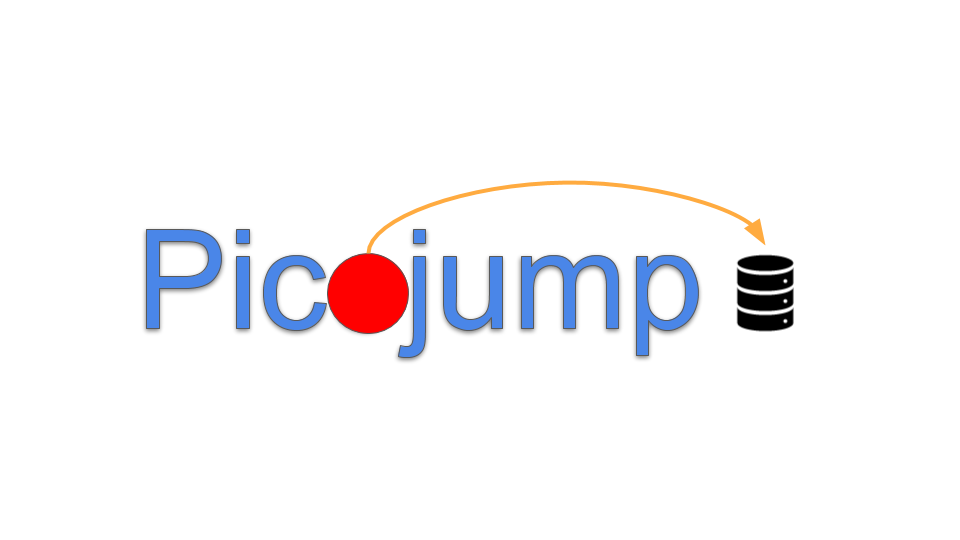

## Picojump: A system for migrating computation to resources

### Abstract

Computing resources are increasingly distributed, creating challenges for programmers and users.  Programmers are faced with the challenge of implementing distributed applications, and users of legacy applications must either co-locate all of the resources or divide the application into tasks that can be executed independently on different hosts.

This paper presents PicoJump, a system that enables legacy applications to execute when their resources are distributed amongst different operating systems.  At runtime, PicoJump interposes on resource access to make remote access transparent.  As well, PicoJump monitors application behavior and migrates the application in order to minimize the amount of remote accesses.  PicoJump leverages prior work in live migration to make migrating applications between hosts fast and efficient.  Our evaluation of a prototype implementation of PicoJump demonstrates that it is feasible and sufficiently performant on multiple real-world applications.

### The First Distributed Migration

Picojump is the first process migration system to boast a distributed migration approach. Traditional approaches only consider process migration between two machines: a source and a destination. Picojump is able to quickly migrate an application within a cluster by enabling _partial migration_. That is, the job scheduler does not move the entire process data at each migration. This makes migration fast.

Picojump uses a new migration algorithm that is a hybrid of the two state-of-the-art live migration approaches: Pre-copy and Post-copy. Like Pre-copy, Picojump restores and application with any state that is clean in the destination machine's cache. Like Post-copy, Picojump pulls dirty resources lazily from the nearest remote machine.

### Transparent Resource Distribution

The brains of Picojump, the 'Manager', is an interposition layer between the process and the underlying operating systems. Through the manager, applications running on Picojump are unaware of whether or not the resource they request is remote or local. It simply works. The manager is able to capture accesses to remote resources in RPC's, and act as a cheap pass-through when resources are local.

### Use Cases
